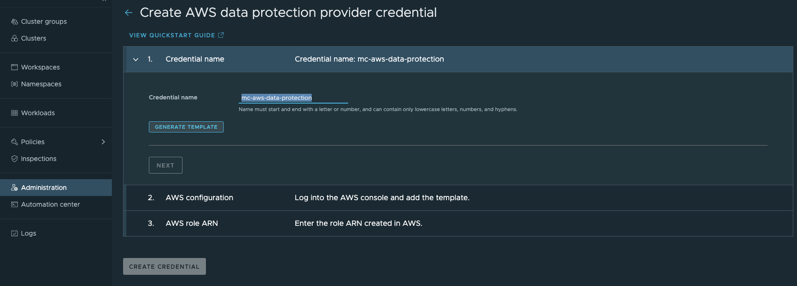
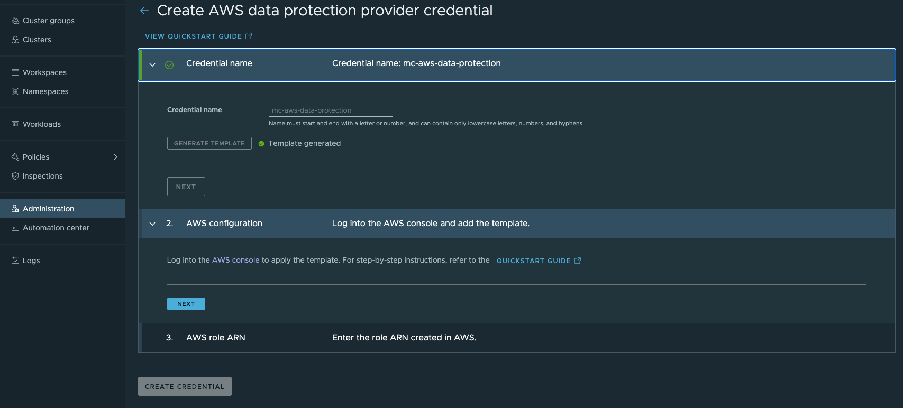
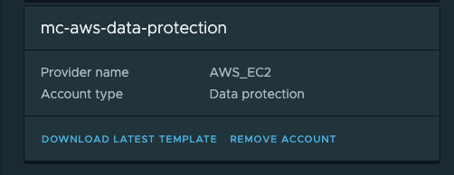
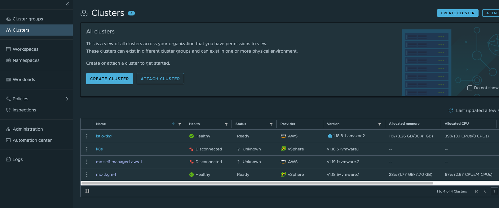
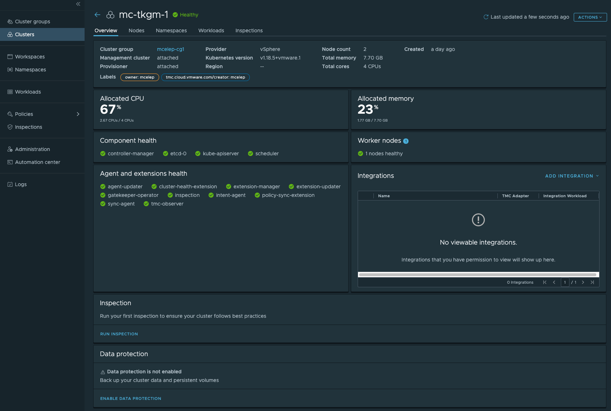
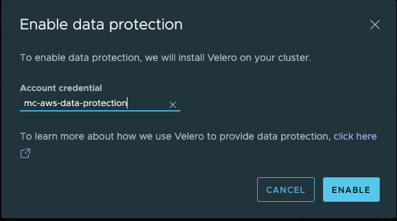

# Enabling data protection for Kubernetes cluster on VMware Tanzu Mission Control

[VMware Tanzu Mission Control](https://tanzu.vmware.com/mission-control) is a centralized management platform for consistently operating and securing your Kubernetes infrastructure and modern applications across multiple teams and clouds.

In this blog post, we will look into how *Data protection* can be enabled for Kubernetes clusters that are managed by VMware Tanzu Misson Control. In the rest of this article, we will refer to VMware Tanzu Mission Control as TMC.

TMC uses [Velero](https://velero.io/) as the backup/restore tool and currently(as of 20.11.2020) AWS is the only public cloud provider that is supported for uploading the backup data. Velero is used for both kubernetes resource backup as well as persistent volume backup. For persistent volume backup, Velero is configured to use Restic and Velero is installed & configured without any user intervention when *Data protection* is enabled on a Kubernetes cluster.

## Requirements

In order to follow the tutorial, you need:

- A TMC account
- A Kubernetes cluster attached to your TMC account
- An AWS account where you are authorized to create a cloudformation stack, IAM roles, S3 bucket
- [AWS CLI](https://aws.amazon.com/cli/)
- Bash shell
- TMC shell which you can download from TMC. After logging onto your TMC, click on *Automation Center* and follow the steps.
- [jq](https://stedolan.github.io/jq/download/) : a CLI tool to parse json data 
## Enable data protection on a K8S cluster

You can follow the steps below to enable data protection on a K8S cluster.

### Create a data protection account on TMC

As mentioned earlier, Velero will require an S3 bucket so let's have TMC provide us a [cloudformation stack](https://docs.aws.amazon.com/AWSCloudFormation/latest/UserGuide/stacks.html). 

Please make sure you have downloaded the TMC cli and are loggged by following the steps listed under *Automation center* section of the UI.

Let's create a data protection account first. Click on the *Administration* link from the menu. This should take you to a screen that looks like the image below:


Now click on *CREATE ACCOUNT CREDENTIAL* and this should bring up a drop down menu. 

From this menu, select *AWS data protection credential* and it should take you to the following screen:

Give your credential a name, I've picked *mc-aws-data-protection* in this example. Before you can move to the next step, you will need to click on *GENERATE TEMPLATE*. This will initiate downloading of a cloudformation stack template file.Check your browser's designated download folder to see the newly downloaded file.


Now you are in the second step of the wizard:


In this step, we have to create a AWS CloudFormation stack based on the template we just downloaded. We can do this either by the AWS Console or via the AWS CLI. We will do it via the AWS CLI in this step.

Before we execute the AWS CLI command to execute stack creation, make sure you're logged on to your AWS account and use credentials that are authorized to create Cloudformation stacks, IAM ManagedPolicies, S3 Buckets, IAM Roles.

When you run the command below, you should get some data back(an empty array or an array with stack elements):

```bash
aws cloudformation describe-stacks
```

If the command above works succesfully, you are ready to execute the command below:

```bash
STACK_NAME=tmc-mc-data-protection aws cloudformation create-stack --template-body="$(<mc-aws-data-protection.template)" --stack-name "$STACK_NAME" --capabilities CAPABILITY_NAMED_IAM
```

The result of this command is a json that looks like this:

```json
{
    "StackId": "arn:aws:cloudformation:us-east-2:XYZ:stack/tmc-mc-data-protection/ABC"
}
```

Cloudformation stacks are generated asynchronously so getting an ID back does not mean that stack creation is successfully completed. So run the following command to check the status of stack creation:

```bash
STACK_NAME=tmc-mc-data-protection aws cloudformation describe-stacks --stack-name="$STACK_NAME"  | jq '.Stacks[0].StackStatus'
"CREATE_IN_PROGRESS"
```

If the status you get is *CREATE_IN_PROGRESS*, from the command above, wait some seconds and then try again, you should eventually get a **CREATE_COMPLETE** status back. If you get a **ROLLBACK_COMPLETE** status instead, analyse what went wrong by looking at the events of the specific stack:

```bash
STACK_NAME=tmc-mc-data-protection aws cloudformation describe-stack-events --stack-name="$STACK_NAME"
```


Assuming the CloudFormation stack is successfully created, now let's find out the **role ARN** created as a part of the stack:

```bash
❯ aws iam get-role --role-name=VMwareTMCProviderCredentialMgr | jq '.Role.Arn'
"arn:aws:iam::XYZ:role/VMwareTMCProviderCredentialMgr"
```

Now you can copy the ARN value into the field provided in the 3rd step and click on *CREATE CREDENTIAL*:


Once the account is created, it will be listed under accounts with the name you provided:


And now we can use this data protection account to enable data protection on a TMC managed/attached cluster.

### Enable data protection on a K8S cluster

Click on the *Clusters* tab from the menu:


and then select the cluster you want to enable data protection on, in this example I pick a cluster called *mc-tkgm-1*:


On the bottom of this screen, there is a section called *Data Protection*. Go ahead and click on *ENABLE DATA PROTECTION* and select the newly created data protection account:



A process will be kicked off in the background to install and configure Velero in the background and once Velero is enabled you should see the *Data Protection* section  updated with the following info: "Run a backup to protect your cluster data". You are now **ready** to schedule a one time or a periodic backup for a specific namespace or for the entire cluster! Have fun!